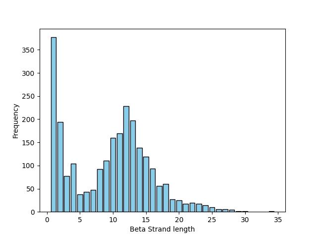
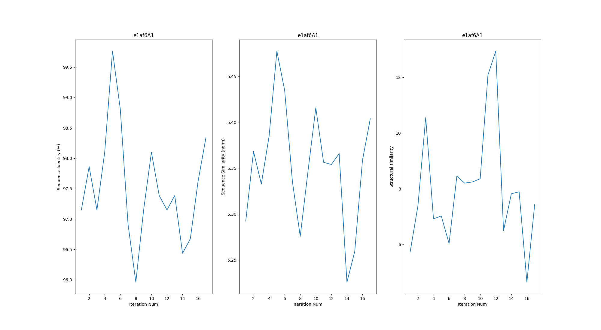

# Project In Molecular Biology

## De Novo Strands Generation

A machine learning project to generate new Beta strands with potential applications in synthetic biology and drug discovery.

### Students: Jerry Abu Ayoub & Mario Barbara


## Prerequisites
```bash
pip install biopython
pip install biotite
pip install esm

cd scripts/
./download_stride.sh
```

## Step 1

clone the repository and change working directory

```bash
git clone https://github.com/Jerryaa98/Protein-strands-generation.git

cd Protein-strands-generation
```

Filter Outliers:

We removed all strands of  25 < length or 5 > length bsed on the strands length distribution below




## Step 2

install all the protein data files (pdb) from the ECOD database and preprocess the data using this python script

```bash
python preprocesser.py --load_pdb True --save_faulty_ids True
```

when finished, there should be a folder with all the pdb files inside, and another folder with all secondary structure files inside that were exctracted using stride as well as a strands.json file with all Meta Information as well as a file with all the faulty sequence IDs.


## Step 3

mask the strands and generate new strands using ESM3, the generation is done by masking iteratively each beta strand, and using the model to predict a sequence, as well as using this newly generated sequence as a prior for the next generation. 

```bash
python strands_generation.py
```

by the end, there should be a general folder for each protein such that it has all the generated sequences for it as new pdb files.

## Step 4

Compare the newly generated strands with the general space of known sequences using three metrics.

- Structrual Similarity (SVD)
- Sequence Identity (Percentage %)
- Sequence Similarity (Blosum Matrix)
  
```bash
python generation_comp.py
```

Example:

